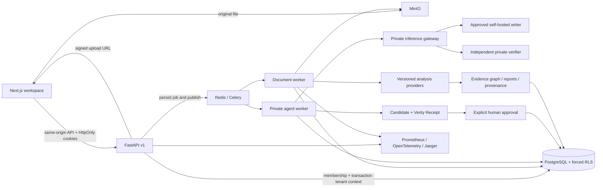

# AZAERON VERITY architecture map

Updated September 30, 2026. The [private agent core](backend/docs/private-agent-core.md) records the CREATE → VERIFY → PROVE implementation and its model/corpus boundaries. The [remediation ledger](docs/verity/REMEDIATION_STATE.md)
and [release decision](docs/verity/RELEASE_CERTIFICATION.md) record current checks
and blockers; [execution history](docs/verity/EXECUTION_STATE.md) preserves the
earlier September 20 snapshot. This map records implemented components and
verification boundaries, not production readiness. The current implementation includes the Similarity workflow and the Document
Intelligence Core. Earlier Slice 0 evidence remains in [docs/slice-0.md](docs/slice-0.md).
The authoritative parser/version contract is in
[backend/docs/document-intelligence-core.md](backend/docs/document-intelligence-core.md);
its command outputs and version-isolation gate are in
[docs/verification/document-intelligence/](docs/verification/document-intelligence/).

## Owned model platform

[Owned-model architecture and runbook](backend/docs/owned-model-platform.md) describes the separate Writer, Verifier, Detector and Embed trainers, original byte-token models, rights-reviewed dataset manifests, held-out evaluations, checkpoint lineage, registry promotion and native private runtime. Only synthetic `TEST_ONLY` checkpoints have been trained; none is approved. Existing Qwen/MiniLM assets remain third-party baselines. Production routes fail closed against the empty approved registry.

The public AI contract adds chat/stream, humanize, detect, version-pinned document summarize/ask and plagiarism/check beside jobs/models/usage. Authentication, scoped API keys, quota/idempotency, source erasure and independent verification remain inside Azaeron. Document Q&A uses bounded owned-model retrieval. [Platform evidence](docs/verity/evidence/owned-model-platform-20260930/) distinguishes executable mechanics from unproven production quality.

## Runtime and trust boundaries

| Area | Entry points and responsibility | Current boundary |
| --- | --- | --- |
| Frontend | `frontend/src/app`, shared `design-system.tsx`, `lib/api.ts`, `lib/workspace.ts` | Frozen products: Azaeron AI, AI Humaniser, AI Detector, Plagiarism Checker and Documents, plus Home and History navigation. Direct paste/type/upload intake and a contextual editor AI panel. |
| Private agent | `api/v1/ai.py`, `modules/agent`, `workers/agent.py` | Actor-private conversations, durable SSE, typed tools, quotas, cancellation, candidate receipts and explicit user decisions. Approved private generation is unavailable. |
| Private models | `modules/inference`, `config/models/registry.json` | Fail-closed licensing/routing, mTLS and independent writer/verifier. Embed/rerank transport and measured candidate selection remain incomplete. |
| Voice and attribution | `modules/agent/voice.py`, `receipts.py`, `similarity/public_index.py` | Owned sample statistics, attributed match resolution with reanalysis, and rights-gated offline lexical indexing. Voice quality and deployed public coverage remain unverified. |
| Session and onboarding | `backend/app/api/v1/auth.py`, `modules/auth`, frontend register/login/onboarding | Signup → persona → idempotent personal workspace → optional invitation → server-selected starting workflow. Persona never grants team permissions. |
| Workspace authorization | `core/dependencies.py`, `modules/organizations` | Signed access cookie with revocable session epoch; active membership rechecked on every request. Server remembers recent workspace; local storage is a per-user preference only. Workspace switches unmount document views until the server validates scope. |
| Database | `core/database.py`, `alembic/versions`, `migration_snapshots/initial_20260826.py` | Migration owner separate from non-owner `azaeron_app`; forced RLS on tenant-resource tables. Transaction settings explicitly clear absent scope. User/organization/membership directory tables remain application-authorized, not protected by tenant RLS. |
| Storage and intake | `api/v1/documents.py`, `modules/uploads`, `modules/processing` | Presigned staging uploads, ownership-bound keys and bounded content checks. Accepted bytes are copied into private snapshots. A guarded legacy-object relocation worker exists. See the release certification for dated recovery evidence. |
| Document intelligence | `modules/processing/structure.py`, `extraction.py`, `modules/documents/target.py` | Frozen normalized text/structure per immutable version, parser identity, deterministic fingerprints, exact Unicode offsets and explicit unavailable mappings. |
| Jobs | `modules/jobs`, `workers/tasks.py`, `workers/celery_app.py` | Celery with late acknowledgement, retry/failure records and idempotency controls. A 72-hour soak is not verified by short tests. |
| Detection and governance | `modules/detection/intelligence`, `modules/governance` | Modular signals, explicit abstention, dataset validation and evaluation gates. No new trained model, measured accuracy claim or approved production model is supplied by Slice 0. |
| Similarity | `modules/similarity/intelligence`, `modules/similarity/service.py` | Version-scoped private-workspace snapshots, indexed token alignment, overlap-aware word coverage, exclusions, source ranking and `/similarity` evidence review. Independent semantic-verifier contracts exist; no approved model is deployed. |
| Citations and authorship | `modules/citations`, `modules/authorship` | Source resolution, claim/reference relationships and authorship consistency records with limitations; independent validation remains necessary. |
| Evidence and provenance | `modules/evidence`, `modules/provenance` | Tenant-scoped graph/report APIs, version lineage and integrity checks. Individual analysis dimensions remain separate. |
| Responsible editing | `modules/aegiswrite` | Protected deterministic suggestions, selective acceptance into a new text version, restore, retry identities, concurrent-edit conflicts and tab-scoped draft recovery. No generative model or semantic-preservation guarantee. |
| Plans and usage | `modules/billing/entitlements.py`, `modules/billing/usage.py` | Free default; server enforces document, upload and revision limits. Durable usage reservations and replay-safe accounting exist. Billing and model-token metering remain unavailable without a model/payment integration. |
| Identity and invitations | `modules/auth`, `modules/organizations/invitations.py`, `modules/identity` | Expiring email-bound invites, SMTP outbox, verified email/reset challenges, TOTP/recovery, session-family revocation and device controls. Production SMTP delivery needs configured infrastructure. |
| Public API | `api/v1`, `modules/auth/api_keys.py` | OpenAPI 3.1, digest-only scoped keys, rotation/revocation, key/tenant rates and usage visibility. Uniform errors/idempotency/pagination across every route remain incomplete. |
| Privacy | `api/v1/privacy.py`, `modules/privacy` | Authorized account, organization and document erasure, object retention and tombstone replay contracts. Agent source dependencies join erasure fencing and cascade cleanup. See the release certification for dated restore evidence. |
| Operations | `docker-compose.yml`, `infrastructure`, `docs/operations.md` | PostgreSQL, Redis, MinIO, API, worker, beat, frontend and self-hosted telemetry. Production load/soak and inference SLOs remain unverified; image findings block release. |

## Historical Slice 0 plan

The following is the earlier plan, retained as context. Current capability and
verification statements above and in the delivery artifacts supersede completed
items; this list is not a claim that completed workflows are still missing.

1. **Finish Slice 0 acceptance:** retain actual command outputs, review recorded
   onboarding and document workflow, and record human manual acceptance separately.
   Baseline exposed missing PostgreSQL tests, broken fresh migration replay,
   backend typing failures and incomplete workspace setup. This slice addresses
   those defects before feature expansion.
2. **Primary Check surface:** existing upload and report pages still need the
   requested three-pane document/finding/evidence experience, filters, exact span
   navigation and its upload-to-export acceptance test. Do not treat the `/check`
   alias as implementation of Prompt 02.
3. **Scientific lifecycle:** build on existing evaluation code; independently
   validate datasets/models, signed evaluation artifacts and explicit human
   promotion approval. No market percentages from the prompt have been adopted
   as verified facts or UI claims.
4. **Similarity/Write/graph gates:** validate corpus scale, semantic drift guards,
   complete editorial version lineage and nontechnical graph traversal under the
   later prompts' acceptance paths.
5. **Commercial and institutional delivery:** metered usage, billing sandbox,
   admin controls, retention/purge, API-key/webhook/SSO/LMS contracts and public
   trust documentation remain later slices. Empty module directories are not
   evidence that these capabilities exist.
6. **Release evidence:** institutional journeys, reproducible security/dependency
   scans, a real payment-provider sandbox, production-like graph checks and the
   72-hour soak remain unverified. No production-readiness claim is made.
