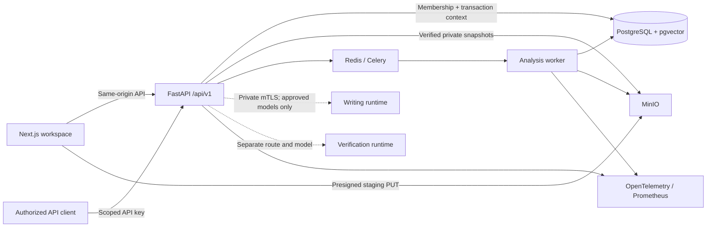

# Azaeron Verity

**Private writing intelligence, grounded in reviewable evidence.**

Azaeron Verity brings document analysis, workspace similarity, citation review,
authorship signals, and responsible editing into a tenant-scoped workspace. Findings
remain attached to the document version that produced them. People review proposed
changes; accepted edits and restores create new revisions with preserved history.

**Release status: NOT PRODUCTION READY.** The release ledger records tested remediation and its evidence. Approved private
models, detector calibration, container security, and production certification
remain release blockers. The [remediation ledger](docs/verity/REMEDIATION_STATE.md)
and [release certification](docs/verity/RELEASE_CERTIFICATION.md) name the
verified source snapshot, executed gates, and release blockers.

[Get started](#get-started) · [Architecture](#architecture) · [API](#api) ·
[Security](#security-and-data-boundaries) · [Verification](#verification) ·
[Operations](#operations) · [Documentation](#documentation)

## Product capabilities

| Capability | What is implemented | Current boundary |
| --- | --- | --- |
| Document intake | Paste or type a draft, or upload a file; both paths use presigned intake, bounded validation, verified private snapshots and asynchronous processing | Legacy relocation, multipart cleanup and real object-erasure drills pass; full backup recovery remains a separate gate |
| Document Editor | Create/import, open, rename, undo/redo, debounced autosave, explicit save status, history, restore, download and archive; review supported whole-draft or selected-passage edits | Humanise and Expand require an approved private model; permanent erasure uses the privacy workflow |
| Reliable saves | Server-backed immutable autosave, stale-parent conflicts, stable draft-save retry identities across tab reloads, and recovery of unsaved working text | Pending drafts are retained for up to 24 hours in this browser tab; completed versions are persisted on the server |
| Similarity review | Version-scoped comparison within the authorized workspace, matched spans, exclusions, source evidence | Similarity alone does not establish plagiarism; external corpus coverage is not claimed |
| Citation and authorship review | Structured findings, provenance, and explicit limitations | A signal does not independently prove authorship or intent |
| Detection | Observable signals, abstention, calibration/evaluation tooling, probability withholding | No calibrated production detector or measured accuracy guarantee |
| Semantic verification | Protected-span and drift checks; independent-verifier contract with explicit outcomes | Nontrivial semantic equivalence is unavailable without an approved independent model |
| Workspace access | Session authentication, active membership checks, explicit mutation permissions, PostgreSQL RLS | Full release-wide authorization and quota recertification is still required |
| API credentials | Scoped keys, display-once secrets, stored digests, expiry, rotation, revocation, audit records, key/tenant rate limits | Local lifecycle and database race checks pass; a complete production authorization/quota review remains required |
| Usage controls | Atomic reservation/commit/release, per-operation attribution, encrypted retry receipts, public usage API and workspace totals | Operation limits are enforced; billing and production throughput are not claimed |
| Privacy controls | Authorized account/workspace/document erasure, durable tombstones, object-version and multipart removal, display-once status receipts | Clean same-host restore/replay and surviving-version hash check pass; offsite recovery is unverified, and an older inconsistent fixture remains fail-closed evidence |
| Identity controls | Verified email, reset delivery, encrypted mail queue, TOTP/recovery and device-session controls | Local SMTP, migration, browser and concurrency tests pass; production SMTP needs operator configuration |

The application does **not** call external AI APIs. Missing inference is reported
as unavailable; it never silently substitutes a hosted model. The empty
[model registry](config/models/registry.json) is intentional. Model weights,
commercial-use approval, evaluation evidence, and suitable private serving
infrastructure must be supplied before model-backed capabilities can be enabled.
Voice profiles are not currently available.

The [academic writing product benchmark](docs/verity/PRODUCT_BENCHMARK.md)
records the bounded comparison behind the input-first workflow and explains why
the product does not promise to defeat Turnitin or other AI detectors.

## Architecture

The existing architecture is Next.js, FastAPI, PostgreSQL, Redis/Celery, and MinIO.
Application and inference boundaries remain separate.



Dashed paths require approved infrastructure that is not supplied by this repository.

A document moves through five boundaries:

1. **Intake:** the API authorizes a staging upload and validates the submitted bytes.
2. **Acceptance:** accepted content is copied to a private snapshot; the reusable
   staging URL cannot replace accepted bytes.
3. **Analysis:** jobs operate on a specific immutable version, preserving input
   fingerprints, parser/model/pipeline identity, and evidence relationships.
4. **Review:** the interface presents findings and proposed edits for human review.
5. **Revision:** acceptance, saving, and restoration append versions. A stale parent
   produces a conflict instead of silently overwriting someone else's work.

See the [architecture map](ARCHITECTURE.md),
[document intelligence contract](backend/docs/document-intelligence-core.md), and
[architecture decisions](docs/verity/DECISIONS.md).

## Get started

### Prerequisites

- Docker Engine or Docker Desktop with Docker Compose v2.
- Python 3 to generate the isolated local Compose configuration.
- Git and access to this repository.
- For frontend development and browser gates: the Node version in [.nvmrc](.nvmrc),
  npm, and the Playwright Chromium browser.
- For backend development outside containers: Python 3.12 and the locked dependencies.
- The Compose file builds MinIO server and client images from checksum-verified,
  pinned upstream source using digest-pinned build and runtime bases. Registry
  credentials are not needed to pull the former Quay image references.

The documented verification environment has exercised Linux ARM64 on an Apple Silicon
host. A prior hosted Linux AMD64 run executed the repository suite, but failed
later in the secret gate; the final source still needs its own hosted run. Optional
ML dependencies have not been certified.
Docker needs enough allocated memory for PostgreSQL, object storage, API, and workers;
private model serving has a separate, model-specific hardware requirement.

### Start an isolated local workspace

From the repository root:

```sh
git clone https://github.com/arajmir7/Azaeron-Verity.git
cd Azaeron-Verity

python3 backend/scripts/prepare_slice0_compose.py \
  --project verity-local \
  --port-offset 1800 \
  --output /tmp/verity-local.json

docker compose -f /tmp/verity-local.json build backend celery-worker migrate frontend

docker compose -f /tmp/verity-local.json up -d \
  --wait --wait-timeout 180 backend celery-worker frontend
```

The generator creates separate project names, networks, and volumes. It writes the
resolved configuration with owner-only permissions; that file contains development
configuration and must not be committed. It does not start a model runtime.

| Local surface | Address |
| --- | --- |
| Web application | <http://localhost:4800> |
| API | <http://localhost:9800> |
| Interactive API reference, development only | <http://localhost:9800/api/docs> |
| OpenAPI schema | <http://localhost:9800/api/openapi.json> |
| MinIO object endpoint | <http://localhost:10800> |
| MinIO administration console | <http://localhost:10801> |

Create an account, sign in, complete onboarding, and select a workspace. In
**Check**, paste or type a draft with a title, or upload a supported file. Open
the resulting document to review version-scoped findings and source coverage.
Use **Write** to choose an editorial focus, review deterministic suggestions,
accept selected changes, and inspect history.

The migration service runs before the API and worker. Database schema changes are
managed through Alembic; application startup does not create or rewrite the schema.

```sh
curl --fail http://localhost:9800/health/live
curl --fail http://localhost:9800/health/ready
curl --fail http://localhost:9800/api/v1/capabilities

docker compose -f /tmp/verity-local.json ps
docker compose -f /tmp/verity-local.json logs --tail=100 backend celery-worker
```

Stop this workspace without deleting its data:

```sh
docker compose -f /tmp/verity-local.json down
```

The root Compose file also supports the conventional ports 3000, 8000, 9000, and
9001. The isolated workflow is useful when those ports or existing project volumes
are already in use. Development credentials and localhost bindings are not a
production deployment configuration.

### Run the frontend against the local API

```sh
nvm install
nvm use
npm ci --prefix frontend

cd frontend
API_URL=http://localhost:9800 npm run dev -- --port 4801
```

For browser mutations, add `http://localhost:4801` to the API's configured
`CORS_ORIGINS` and recreate the API with that configuration. Keep
`NEXT_PUBLIC_API_URL` empty to use the Next.js same-origin API rewrite. Values
prefixed with `NEXT_PUBLIC_` are browser-visible and must never contain secrets.

### Local identity email

The optional `mail` profile provides a self-hosted Mailpit inbox. Enable it only for
local development, regenerate the isolated configuration, and start the mail sender:

```sh
EMAIL_ENABLED=true EMAIL_PUBLIC_URL=http://localhost:4800 SMTP_STARTTLS=false \
  python3 backend/scripts/prepare_slice0_compose.py \
  --project verity-local --port-offset 1800 --output /tmp/verity-local.json

docker compose -f /tmp/verity-local.json up -d \
  backend celery-worker celery-beat mailpit
```

The local inbox is at <http://localhost:9825>. Verification and reset links expire
and work once. Delivery runs from the encrypted outbox through Celery's periodic
sender. Production requires self-controlled SMTP with TLS and a dedicated
`IDENTITY_ENCRYPTION_KEY`; Mailpit is a development sink.

## Configuration

[Backend settings](backend/app/core/config.py) define validation and defaults.
[backend/.env.example](backend/.env.example) is a development reference; Compose
receives its values from the shell or a root `.env` file. These are distinct paths.

| Setting | Purpose |
| --- | --- |
| `ENVIRONMENT` | Selects development or production validation |
| `DATABASE_URL` | Runtime database connection using the non-owner application role |
| `MIGRATION_DATABASE_URL` | Migration-owner connection; keep it out of API/worker credentials |
| `REDIS_URL` | Rate limiting, task broker, and worker coordination |
| `MINIO_ENDPOINT` | Internal object-store endpoint |
| `MINIO_PUBLIC_ENDPOINT` | Browser-reachable host for signed upload/download URLs |
| `MINIO_ACCESS_KEY`, `MINIO_SECRET_KEY` | Application-scoped object-store credentials |
| `SECRET_KEY`, `REFRESH_SECRET_KEY` | Separate access and refresh signing keys |
| `CORS_ORIGINS` | Explicit allowed browser origins |
| `ZERO_EXTERNAL_AI_API` | Enforces the prohibition on external AI providers |
| `INFERENCE_ENABLED` | Enables approved private inference; defaults to false |
| `MODEL_REGISTRY_PATH` | Local model approval and routing registry |
| `INFERENCE_ENDPOINT`, `INFERENCE_VERIFY_ENDPOINT` | Separate private writer/verifier endpoints |
| `INFERENCE_CA_FILE`, `INFERENCE_CERT_FILE`, `INFERENCE_KEY_FILE` | Mutual-TLS trust and client identity |
| `PRIVACY_MINIO_ACCESS_KEY`, `PRIVACY_MINIO_SECRET_KEY` | Independent worker credential for scoped erasure and retention; never supplied to the browser/API |
| `IDENTITY_ENCRYPTION_KEY` | Dedicated encryption key for MFA secrets and queued identity mail |
| `EMAIL_ENABLED`, `EMAIL_PUBLIC_URL` | Identity-mail availability and canonical browser origin |
| `SMTP_HOST`, `SMTP_PORT`, `SMTP_FROM`, `SMTP_STARTTLS` | Self-controlled email transport |
| `SMTP_USERNAME`, `SMTP_PASSWORD` | Optional SMTP authentication |
| `OTEL_EXPORTER_OTLP_ENDPOINT`, `OTEL_SERVICE_NAME`, `RELEASE_ID` | Private telemetry destination, service and immutable release identity |
| `METRICS_TOKEN`, `METRICS_TOKEN_FILE` | Matching API scrape credential and private Prometheus credential file |

Do not commit resolved Compose files, real `.env` files, credentials, customer
content, database dumps, or model weights. Set production credentials through the
deployment's secret mechanism. Enabling a setting does not establish release readiness.

## API

The application contract is under `/api/v1`; runtime-generated OpenAPI is available
at `/api/openapi.json`. The [checked-in schema](docs/verity/openapi.json) is a
certification artifact and must be regenerated when recertifying changed routes.

Browser authentication uses HttpOnly cookies, refresh rotation, and CSRF protection.
API clients use `X-API-Key` on the documented public operations. Organization scope
comes from authenticated server state, not a tenant identifier supplied in the body.

Owners and administrators manage keys in **Settings → Security → Workspace API keys**.
Create/rotate responses show the secret once. List responses expose metadata only.
The database stores a digest of each high-entropy credential.

```sh
# Set AZAERON_API_KEY securely in your local environment first.
curl --fail-with-body \
  -H "X-API-Key: ${AZAERON_API_KEY}" \
  http://localhost:9800/api/v1/documents
```

| Scope | Intended access |
| --- | --- |
| `documents:read` | Document and job reads |
| `documents:write` | Authorized document mutations and job cancellation |
| `text:analyze` | Text analysis and approved-model metadata |
| `text:refine` | Private refinement requests |
| `text:verify` | Verification requests |
| `usage:read` | Usage visibility |

No wildcard administrator scope is supported. Text analysis exposes deterministic
statistics and an indeterminate authorship result. Usage returns tenant quota totals
and the caller’s operation metadata. See the [usage contract](docs/verity/USAGE.md)
for reservation, replay, expiration and privacy behavior. OpenAPI’s `x-api-key-scopes`
annotation describes each public operation’s required scope.

Clients should handle these responses deliberately:

| Status | Client behavior |
| --- | --- |
| `401` | Reauthenticate or replace an invalid, expired, or revoked credential |
| `403` | Review membership, permissions, scopes, and browser-origin policy |
| `404` | Treat inaccessible tenant resources as unavailable |
| `409` | Resolve a stale revision, replay conflict, or already-rotated credential |
| `422` | Correct the request shape or validation error |
| `429` | Honor `Retry-After` |
| `503` | Preserve user input and report the unavailable dependency or capability |

Use the same operation identity when retrying an immutable document operation after
a lost response. Changing the payload while reusing that identity is a conflict.
See [API contracts](docs/verity/API_CONTRACT.md) and [API-key behavior](docs/verity/API_KEYS.md).

## Security and data boundaries

- **Tenant isolation:** active membership and explicit service permissions combine
  with forced PostgreSQL RLS on tenant-resource tables. Migration and application
  roles are separate. Account/directory tables have application authorization;
  this is not a claim that every table has tenant RLS.
- **Credential handling:** browser tokens stay in HttpOnly cookies. API-key secrets
  are shown once; explicit invalid API credentials do not fall back to cookies.
- **Document integrity:** accepted uploads use private verified snapshots. Revisions
  retain lineage and content hashes; history restoration appends a revision.
- **Private inference:** approved artifact hashes, explicit model identity, bounded
  requests, private endpoints, mutual TLS, no redirects or inherited proxies, and
  no external-provider fallback.
- **Conservative findings:** uncalibrated detection withholds production probability
  claims. Protected-span checks are not represented as proof of semantic equivalence.
- **Runtime isolation:** the backend runtime uses a digest-pinned distroless base,
  non-root execution, and a minimal native-library set. Build/test tools stay in
  separate stages.

Privacy and retention are covered in the [erasure policy](docs/verity/PRIVACY.md).
Infrastructure-image findings remain open; recovery evidence covers a small
same-host synthetic drill rather than deployment-scale or geographic recovery.
Archiving a document retains history and does
not mean its data has been erased. Report suspected vulnerabilities through the
repository's private security-reporting facility when enabled, or a private channel
to the repository owner. Do not publish credentials or customer material in an issue.

## Verification

Evidence is retained with command results and source manifests. Read the scope of a
result before using it: a synthetic fixture, mocked browser test, and live PostgreSQL
integration test establish different things.

| Evidence | Recorded result and scope |
| --- | --- |
| [Current repository gate](docs/verity/evidence/final-blocker-burndown/repository-final/results.json) | All 11 source-stable gates passed: 251 backend tests, 30 real PostgreSQL/RLS tests and 27 browser tests at the recorded manifest |
| [Current image gate](docs/verity/evidence/final-blocker-burndown/all-images/results.json) | Fifteen image scans and SBOMs; four image families fail with 411 HIGH and 20 CRITICAL findings |
| [Current local performance profile](docs/verity/evidence/final-blocker-burndown/load-final/budgets.json) | 284 requests and 56 completed jobs; unchanged proposed local HTTP budgets pass |
| [Current recovery drill](docs/verity/evidence/final-blocker-burndown/recovery/recovery-result.json) | Fresh PostgreSQL/MinIO restore and post-backup privacy-erasure replay pass |
| [R15 historical repository gate](docs/verity/evidence/final-production-certification/repository-final/results.json) | All 11 source-stable gates passed: 250 backend tests, PostgreSQL integration, frontend checks, and 25 browser tests at its earlier source manifest |
| [Historical R15 all-image scan](docs/verity/evidence/final-production-certification/all-images/results.json) | 15 distinct images and 15 SBOMs; application images and Mailpit pass; verification and eight infrastructure images still fail HIGH/CRITICAL policy |
| [Historical R15 recovery replay](docs/verity/evidence/final-production-certification/recovery-r15-control/recovery-result.json) | Post-snapshot erasure replay passed; deleted account rejected, two objects removed, and one unrelated immutable version verified |
| [Historical R15 measured load](docs/verity/evidence/final-production-certification/load-final/profile.json) | 284 measured requests and 56 completed jobs; no unexpected HTTP responses, but the proposed save/conflict latency budget fails |
| [Historical repository gate](docs/verity/evidence/release-formatted/results.json) | Formatting, lint, types, frontend build, Compose, 166 backend tests, 15 PostgreSQL tests, and 18 browser tests at its named snapshot |
| [R1 repository regression](docs/verity/evidence/remediation/r1/regression/results.json) | Existing repository gates passed after runtime-image remediation |
| [R1 image gate](docs/verity/evidence/remediation/r1/images-final/results.json) | The scanned R1 backend artifact had 0 HIGH and 0 CRITICAL findings; SBOM produced |
| [Private routing contracts](docs/verity/evidence/remediation/r2/routing-contracts.log) | 40 inference/verification contract tests; no live model execution claimed |
| [Detector protocol](docs/verity/evidence/remediation/r4/contracts-final.log) | 17 detector/governance tests; synthetic protocol verification, not production calibration |
| [API-key database race](docs/verity/evidence/remediation/r5/postgres-concurrency-first.log) | Actual PostgreSQL authentication, tenant isolation, concurrent use, and single-winner rotation |
| [API-key browser test](docs/verity/evidence/remediation/r5/browser-fixed.log) | Display-once, rotation/revocation, browser-storage checks, narrow layout, and automated axe checks against mocked API responses |

The historical R15 evidence applies to its named manifest and pinned images. Hosted CI
execution, production soak/SLOs, complete manual accessibility, model quality,
and deployment-scale/offsite disaster recovery still require their own runs.

### Execute the repository gate

Provision a dedicated verification stack; never point integration gates at customer
data or the primary development database.

```sh
npm ci --prefix frontend
npx --prefix frontend playwright install chromium

python3 backend/scripts/prepare_slice0_compose.py \
  --project verity-check --identity-mail \
  --port-offset 1900 \
  --output /tmp/verity-check.json

docker compose -f /tmp/verity-check.json --profile verification \
  build backend celery-worker celery-beat migrate frontend verification

docker compose -f /tmp/verity-check.json up -d \
  --wait --wait-timeout 180 backend celery-worker frontend

python3 scripts/verity_gate.py \
  --compose /tmp/verity-check.json \
  --browser-url http://localhost:4900 \
  --output docs/verity/evidence/local-check
```

The gate runs Black, Ruff, mypy, unit/security/worker contracts, real PostgreSQL
integration tests, ESLint, TypeScript, a production frontend build, Compose
validation, and live/mocked browser suites. It rejects the primary project and
shared/external verification volumes. Missing or skipped required suites do not
substitute for executed evidence.

Additional gates include dependency audits, Bandit, the
[source secret gate](scripts/verity_secret_gate.py), and the
[image/SBOM gate](scripts/verity_image_gate.py), which accepts `--compose`
to cover every service in every profile. The current all-image findings and
digest/update policy are documented in the
[image security report](docs/verity/IMAGE_SECURITY.md). The
[GitHub Actions workflow](.github/workflows/verity.yml) defines hosted execution;
a workflow file is not evidence that hosted checks have passed.

## Operations

- `/health/live` reports process liveness.
- `/health/ready` checks required dependencies and returns 503 when readiness fails.
- Prometheus, Grafana, OpenTelemetry, and Jaeger configuration lives under
  [infrastructure](infrastructure). Telemetry installation alone does not establish
  an observed SLO.
- Celery handles asynchronous work with retry/failure records and worker heartbeats.
  Scale and recovery depend on measured workload and database/object-store capacity.
- Back up PostgreSQL **and** MinIO with their version relationships, configuration,
  and required encryption keys. A database-only restore cannot establish complete
  document recovery.
- Privacy tombstones and backup-retention policy must govern reactivation of restored
  data. Do not assume deleting a live row immediately deletes historical backups.

See the [operations runbook](docs/operations.md),
[failure-gate scope](docs/failure-gate.md), and
[historical scale-gate measurements](docs/scale-gate.md), and the
[current local application profile](docs/verity/PERFORMANCE.md). Targets are
documented separately from measured results.

### Troubleshooting

| Symptom | First check |
| --- | --- |
| A published port is already in use | Generate a new isolated configuration with an unused port offset |
| Readiness returns 503 | Inspect dependency health, completed migrations, and worker heartbeat; retain the request ID |
| Browser writes return 403 | Match the browser origin to `CORS_ORIGINS`; check membership and CSRF policy |
| Upload succeeds but confirmation fails | Check browser-reachable MinIO endpoint, size/hash validation, and staging ownership |
| A save returns 409 | Reload the latest parent version and resolve the conflict; preserve the working draft |
| Refinement returns unavailable | Inspect capability discovery and model approval; deterministic editing does not enable private generation |
| A key no longer works | Check expiry, revocation, rotation, issuing-account membership, and required scope |
| An old evidence report disagrees with source | Compare its manifest/snapshot and use the current remediation ledger |

## Repository layout

```text
backend/
  app/api/v1/          HTTP contracts and authentication boundaries
  app/core/            Configuration, security, database context, observability
  app/modules/         Document, analysis, identity, inference, and domain services
  app/workers/         Celery execution and failure handling
  alembic/             Versioned database migrations
  scripts/             Runtime assembly, local-stack preparation, evaluation tools
  tests/               Unit, API, security, worker, and PostgreSQL integration tests
frontend/
  src/app/             Public, authentication, and workspace routes
  src/components/      Shared interface components
  src/lib/             API client and workspace state
  tests/               Browser workflows and accessibility checks
config/models/         Model approval and task-routing registry
infrastructure/        Telemetry, object-store policy, private inference manifests
scripts/               Repository, image, and secret gates
docs/verity/           Decisions, contracts, remediation, certification, evidence
.github/workflows/     CI definitions
```

## Documentation

| Area | Reference |
| --- | --- |
| Current remediation | [REMEDIATION_STATE.md](docs/verity/REMEDIATION_STATE.md) |
| Release evidence and verdict | [RELEASE_CERTIFICATION.md](docs/verity/RELEASE_CERTIFICATION.md) |
| Execution history | [EXECUTION_STATE.md](docs/verity/EXECUTION_STATE.md) |
| Architecture and decisions | [Architecture map](ARCHITECTURE.md), [ADRs](docs/verity/DECISIONS.md) |
| Security and AI boundaries | [Security model](docs/verity/SECURITY_MODEL.md), [AI system](docs/verity/AI_SYSTEM.md) |
| Observability | [Telemetry operations and verified scope](docs/verity/OBSERVABILITY.md) |
| Performance | [Measured local application profile and release targets](docs/verity/PERFORMANCE.md) |
| Accessibility | [Critical workflow review and remaining certification gaps](docs/verity/ACCESSIBILITY.md) |
| Recovery | [PostgreSQL, MinIO, and privacy replay procedure](docs/verity/RECOVERY.md) |
| Image security | [Complete inventory, SBOMs, and unresolved findings](docs/verity/IMAGE_SECURITY.md) |
| Deprecations | [Pydantic warning cleanup](docs/verity/DEPRECATIONS.md) |
| Identity and email | [Identity contract](docs/verity/IDENTITY.md) |
| API and credentials | [API contract](docs/verity/API_CONTRACT.md), [API keys](docs/verity/API_KEYS.md) |
| Similarity and evidence | [Similarity workflow](backend/docs/similarity-workflow.md), [evidence graph](backend/docs/evidence-graph.md) |
| Private model serving | [Inference deployment](infrastructure/inference/README.md) |
| Detector evaluation | [Calibration protocol](docs/verity/DETECTOR_EVALUATION.md) |
| Verification policy | [Quality gates](docs/verity/QUALITY_GATES.md) |
| Operations | [Runbook](docs/operations.md) |

## Engineering changes

Preserve working contracts and tenant boundaries. Include a regression test for a
behavioral fix, a migration for schema changes, and a concise decision record for a
material architectural change. PRs should explain the concrete problem, resulting
behavior, executed checks, and remaining limitations. Keep generated caches, secrets,
customer data, and model weights out of commits. Never substitute an accuracy or
readiness assertion for an evaluation artifact.

No repository-wide license grant is currently declared. Check with the repository
owner before redistribution. Third-party packages and model artifacts retain their
own licenses; a model's presence on disk does not establish commercial-use approval.
