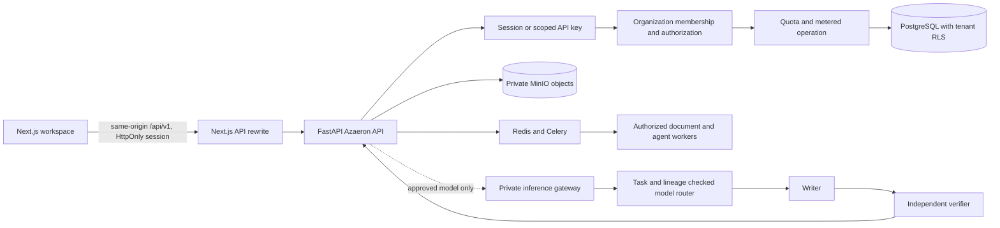

# Azaeron Verity integration map

Updated 2026-09-30. This map follows the browser from its screen through the Azaeron API to storage, workers and approved private runtimes. It describes implemented connections and their present limits; it is not a production certification.

## Request path and trust boundaries

The frontend calls relative `/api/v1/...` URLs. Next.js rewrites those requests to the configured private FastAPI service; `NEXT_PUBLIC_API_URL` stays empty in the same-origin deployment. The API client sends session cookies and refreshes expired sessions. Login, password recovery, identity verification, MFA, organization selection, API-key scope checks, entitlements, operation metering, receipts and RLS live in the backend. The browser never receives model-runtime credentials or a model-service URL.

Customer-visible public model API routes are mounted with the other Azaeron v1 routers. Model-backed operations use the private gateway, approved registry and independent verification policy. Missing models or verifier capacity return unavailable/uncertain errors; the API does not route to hosted providers. Current production registry contains zero approved models.

## Product and screen connections

| Product or screen | Frontend | Azaeron API and downstream path | Present behavior and limits |
| --- | --- | --- | --- |
| Home | `frontend/src/app/(dashboard)/dashboard/page.tsx` | `GET /documents`, `GET /ai/conversations`, `GET /models` | Loads each panel independently. Recent chats deep-link into the selected saved conversation; model availability comes from the approved registry. Recent reports link to a document's report. |
| Azaeron AI | `frontend/src/app/(dashboard)/ai/page.tsx`, `frontend/src/components/agent-panel.tsx` | Conversation list/create/detail/message/update/delete and replayable SSE under `/ai/conversations`; `/ai/runs/{id}/cancel`; `/ai/voice-profiles`; document receipts and decisions | Actor- and tenant-scoped persistence, search, rename, delete, prompt edits, retry identity, streaming events, cancellation, attachments, authorized document tools, voice profiles and explicit receipt acceptance are wired. A user request can be saved while generation is unavailable; no assistant reply is fabricated. |
| Humaniser / editor | `frontend/src/app/(dashboard)/humaniser/page.tsx`, `frontend/src/app/(dashboard)/write/page.tsx` | `/documents`, `/documents/{id}/content`, `/aegiswrite/suggest`, `/aegiswrite/refine`, `/aegiswrite/apply`, `/documents/{id}/revisions`, `/ai/documents/{id}/receipts` | Current on-screen suggestions use the deterministic editorial engine, are version-bound and require review before application. This is not the approved Writer model or a claim of semantic/factual generation quality. The dedicated model-backed `POST /humanize` route fails closed without an eligible private Writer and independent Verifier. |
| AI Detector | `frontend/src/app/(dashboard)/detector/page.tsx` | `/documents`, `/detection/documents/{id}`, `/detection/documents/{id}/explain` | Reads experimental signals with abstention and limitations. No calibrated production score is claimed. The separate `POST /detect` public model endpoint requires an approved Detector; none is registered. |
| Plagiarism Checker | `frontend/src/app/(dashboard)/plagiarism/page.tsx`, `frontend/src/app/(dashboard)/similarity/page.tsx` | `/similarity/corpora`, `/similarity/documents/{id}/analysis`, `/matches`, `/matches/{match}`, `POST /plagiarism/check` | Compares against the actual indexed workspace corpus. It reports matching evidence, not an Internet-wide search or a misconduct/plagiarism decision. |
| Documents | `frontend/src/app/(dashboard)/documents/page.tsx`, `frontend/src/app/(dashboard)/check/page.tsx`, `frontend/src/components/document-intake.tsx` | `/documents/upload-request`, scoped MinIO PUT, `/documents/upload-confirm`, `/documents`, `/documents/{id}`, `/content`, `/structure`, `/download`, `/versions`, `/revisions`, `/jobs` | Authenticated upload admission, checksum verification, private object storage, asynchronous extraction and immutable document versions. Processing states remain visible. |
| Document report and evidence | `frontend/src/app/(dashboard)/documents/[id]/page.tsx`, reports, graph, citations, authorship, sources and provenance screens | `/reports/documents/{id}`, `/evidence/documents/{id}/graph`, `/citations/documents/{id}/analysis`, `/authorship/documents/{id}/analysis`, `/provenance/documents/{id}/timeline`; similarity routes | Each view reads evidence for a tenant-authorized document/version. Authorship is a signal, not proof. Report dimensions may be unavailable or insufficient. |
| History | `frontend/src/app/(dashboard)/history/page.tsx` | `/documents`, `/provenance/documents/{id}/timeline`, editor history and receipt APIs | Aggregates recorded document versions and provenance; it does not infer missing events. |
| Settings and administration | `frontend/src/app/(dashboard)/settings/page.tsx`, `frontend/src/components/settings/*`, admin | `/auth/me`, `/auth/sessions`, `/auth/mfa/*`, `/api-keys`, `/organizations`, `/organizations/{id}/entitlements`, `/usage`, `/privacy/erasures` | Session/MFA management, scoped API keys, workspace membership, measured usage and erasure requests use backend role checks. Display-once key secrets stay out of list views. |

## Public API contract

| Required path | Integration point | Gate applied | Current qualification |
| --- | --- | --- | --- |
| `POST /api/v1/ai/chat` | `backend/app/api/v1/model_platform.py` | Session or scoped key, active workspace, entitlement/metering, task route, independent verifier, reauthorization before release | Fails closed with no approved Writer or verifier. |
| `POST /api/v1/ai/chat/stream` | Same module; SSE `delta` events are marked provisional; final event follows verification | Same gates; stream cancellation and reauthorization; rejected provisional output is not returned as an accepted answer | No production runtime is available to exercise generation. |
| `POST /api/v1/humanize` | Same module; deterministic/editor API remains separately exposed | Writer + independent verifier for model route | No approved Writer; current editor suggestions have narrower deterministic behavior. |
| `POST /api/v1/detect` | Same module | Approved Detector, entitlement, tenant authorization | Unavailable as an approved model capability. |
| `POST /api/v1/plagiarism/check` | Same module delegates to the workspace similarity/report services | Version and document authorization, entitlement/metering, source coverage | Workspace indexed corpus only; no external corpus. |
| `POST /api/v1/documents/{id}/summarize` | Same module | Exact document version, tenant rights, retrieval bounds, Writer and Verifier, metering | No approved Writer. |
| `POST /api/v1/documents/{id}/ask` | Same module | Exact document version, bounded authorized retrieval, Writer and Verifier, metering | No approved Writer. |
| `GET /api/v1/jobs/{id}` | `backend/app/api/v1/jobs.py` | Owner/organization-scoped read | Processing status is available for actual queued jobs. |
| `GET /api/v1/models` | `backend/app/api/v1/models.py` | Authenticated registry view | Returns approved entries only; currently zero. |
| `GET /api/v1/usage` | `backend/app/api/v1/usage.py` | Authenticated workspace usage | Reads real metered operation records; it does not certify billing or capacity. |

The public API and the conversational UI are two interfaces to Azaeron-owned application services. Chat UI requests use the durable conversation API so that messages, events, tool results, receipts, cancellation and access checks share one persisted operation. Stateless public chat calls use the dedicated chat contract. Neither interface calls an external AI provider.

## Model and data lineage

`backend/app/modules/inference/` owns bundle validation, signed/hashed registry policy, task routing, the private gateway and independent verifier checks. The serving path consumes only approved, pinned, private bundles. It fails closed when runtime identity, model hash, policy, mTLS or registry evidence is missing. `GET /models` exposes public model metadata, not runtime credentials. `GET /capabilities` explicitly reports that the system is not production-certified.

The four families are Writer, Verifier, Detector and Embed. Existing original, byte-token smoke checkpoints remain `TEST_ONLY`; third-party local bundles remain baselines. Current foundation dossiers are metadata-only: 11 candidates, zero admitted; three potentially eligible model repositories remain `REVIEW_REQUIRED`, and the rejected repositories remain rejected for their recorded policy reasons. Candidate weight payloads were not downloaded or promoted. Production dataset registry contains no approved training splits. Rights, source/author/document lineage, PII/copyright review and task grants must pass before training.

Consequently, no production fine-tuning run, production checkpoint, quality bake-off, blinded human review or production model-serving claim exists. The local M4 supports pipeline and bounded development work; the planned CUDA QLoRA profile is an estimate, not a measured training job. Continuing useful production training requires an accountable commercial-rights decision, rights-reviewed datasets, independent blinded reviewers, an admitted base and capable measured hardware. Synthetic CI samples may only exercise mechanics.

## Test and evidence index

- UI behavior, workspace scoping, loading/failure states and deep links: `frontend/tests/onboarding.spec.ts`, `frontend/tests/agent-live.spec.ts`.
- Accessibility, responsive widths and keyboard behavior: `frontend/tests/accessibility-live.spec.ts`, `frontend/tests/accessibility-review.spec.ts`.
- Current authenticated Azaeron AI empty-state capture from the isolated live browser run: [chat screen](evidence/commercial-production-20260930/frontend-audit/05-ai-after-final.png).
- Backend public model contract and fail-closed policy: `backend/tests/test_model_platform.py`, `backend/tests/test_private_inference.py`, `backend/tests/security/test_zero_external_ai.py`.
- Conversation persistence, tenant authorization and RLS: `backend/tests/test_agent.py`, `backend/tests/integration/test_agent_rls.py`.
- Dataset rights and split leakage checks: `backend/tests/test_candidate_program.py`.
- Hosted build, image, SBOM and security evidence is tracked by exact commit under `docs/verity/evidence/commercial-production-20260930/` and in the draft review PR. A green UI build or a successful smoke test is not model approval.
